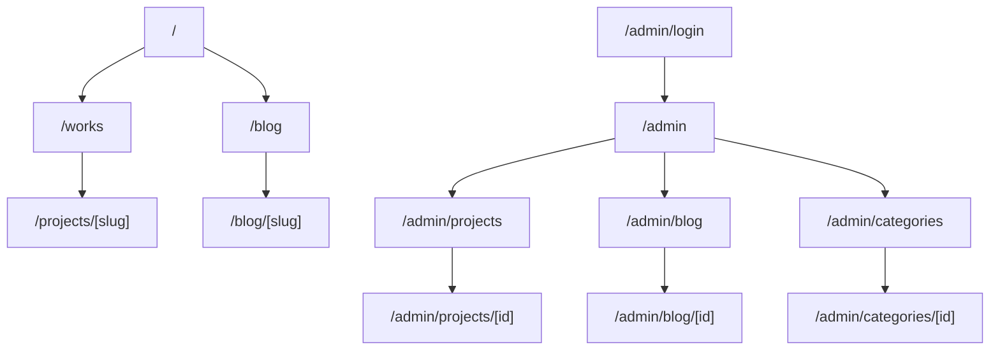

# Portfolio CMS - Design Brief

## 1. Design Intent

Two surfaces, one identity:
- **Admin CMS** (`/admin/*`): a focused, calm content tool modeled on the Webflow CMS layout the
  owner already knows - left collections rail, center list/table, editor panel. Product register:
  design SERVES the task. Dark, quiet, keyboard-friendly, fast.
- **Public site** (`/`, `/works`, `/projects/[slug]`, `/blog`, `/blog/[slug]`): carries the
  existing portfolio identity (dark canvas, oversized display headings, all-caps micro-labels,
  restrained motion). Brand register: design IS the product.

Anti-slop commitments: no cream/SaaS default, no gradient text, no glassmorphism-by-default,
no eyebrow on every section, no identical card grids as a crutch. The existing brand's dark,
typographic character is preserved and extended.

## 2. Brand Tokens (derived from existing site)

The current site is dark with a vivid blue focus/accent (`#4d65ff`) and large display type.
Tokens defined in OKLCH for the new app:

```css
:root {
  /* Canvas */
  --bg:        oklch(0.16 0.012 265);   /* near-black, faint cool tint */
  --surface:   oklch(0.21 0.015 265);   /* cards, rows, panels */
  --surface-2: oklch(0.26 0.016 265);   /* raised / hover */
  --border:    oklch(0.32 0.014 265);
  --border-strong: oklch(0.42 0.016 265);

  /* Ink */
  --ink:        oklch(0.97 0.005 265);  /* primary text */
  --ink-muted:  oklch(0.74 0.012 265);  /* secondary */
  --ink-faint:  oklch(0.58 0.012 265);  /* tertiary / captions */

  /* Accent (brand blue #4d65ff) */
  --accent:      oklch(0.60 0.22 268);
  --accent-hover:oklch(0.65 0.22 268);
  --accent-ink:  oklch(0.98 0.01 268);  /* text on accent */

  /* Status */
  --success: oklch(0.72 0.17 150);
  --warning: oklch(0.80 0.15 85);
  --danger:  oklch(0.63 0.22 25);

  /* Radius */
  --radius-sm: 8px; --radius-md: 12px; --radius-lg: 16px; --radius-xl: 20px; --radius-full: 9999px;
}
```

Typography: system/geometric sans for UI (`-apple-system, "SF Pro Text", Inter, sans-serif`);
display headings on public pages use a large clamp scale (max <= 6rem, letter-spacing >= -0.04em),
`text-wrap: balance` on h1-h3, body capped at 65-75ch.

Spacing: 8pt grid (`--space-1..12` = 4-48px). Semantic z-index scale:
dropdown -> sticky -> modal-backdrop -> modal -> toast -> tooltip.

## 3. Information Architecture



Admin nav (collections rail): Projects, Blog Posts, Project Categories. Mirrors Webflow.
Public nav: About, Work, Blog, Contact (+ Resume, Schedule a call) - matches current site.

## 4. Key Flows

### Publish a project (happy path)
1. `/admin/projects` list -> New Project.
2. Fill Basic Info (title auto-generates slug), pick category, add card image + gallery.
3. Build body in block editor.
4. Save Draft (autosaves) -> Preview -> Publish.
5. Publish sets `status=published`, `published_at`, and revalidates `/works` + `/projects/[slug]`.

### Edit a published item (no half-published state)
- Editing writes to the row but the public route only reflects changes after Publish is pressed
  again (explicit re-publish triggers revalidation). Draft edits never leak live.

### Image upload
- Drag file -> client validates type/size -> upload to Supabase Storage -> URL stored -> optimistic
  thumbnail with rollback on failure.

## 5. Component Map

Shared primitives: `Button`, `IconButton`, `Input`, `Textarea`, `Select`, `Switch`, `Badge/StatusPill`,
`Toast`, `Skeleton`, `Dialog` (native `<dialog>`), `Drawer`, `Field` (label+control+error).

Admin: `AdminShell` (rail + topbar + content), `CollectionRail`, `CollectionList` (searchable/sortable
table), `ListRow`, `EditorLayout`, `BasicInfoForm`, `MediaUploader`, `GalleryGrid`, `BlockEditor` (Tiptap),
`PublishBar` (Save/Preview/Publish/Unpublish), `EmptyState`.

Public: `SiteNav`, `WorkGrid`, `WorkCard`, `ProjectHero`, `RichContent` (renders Tiptap JSON),
`BlogList`, `BlogCard`, `PostHero`, `SiteFooter`.

## 6. Interaction Specs (ux-interaction-patterns)
- All feedback within 400ms; durations use tokens (`--dur-fast 100ms`, `--dur-normal 200ms`,
  `--dur-moderate 300ms`, `--dur-slow 400ms`).
- Loading: skeleton screens for lists/editor; inline spinner only inside buttons (<48px). No full-page spinner.
- Optimistic UI for publish/feature/favorite toggles with rollback + toast on failure.
- Success states animate (checkmark draw / green flash), never a static swap.
- Enter animations `ease-out`, exit `ease-in`; `prefers-reduced-motion` swaps slides for fades and shortens durations.
- Targets: primary actions >= 44x44px, icon buttons >= 24x24px with padded hit area.
- Hick's law: max ~7 visible actions per row; overflow behind a "More" menu.

## 7. Responsive (responsive-design)
- Mobile-first. Admin: rail collapses to a top drawer/segmented control; list table becomes stacked
  cards (`data-label` pattern); editor goes full-screen with a sticky publish bar.
- Public: fluid `clamp()` type/spacing; `repeat(auto-fit, minmax(280px, 1fr))` work grid;
  responsive images with `srcset`/`sizes`, `aspect-ratio` to prevent CLS.
- Breakpoints: 480 / 768 / 1024 / 1280.

## 8. States (every screen)
- Empty (no items yet -> guidance + primary CTA), Loading (skeleton), Error (retry), Success (toast/anim).
- Draft vs Published clearly distinguished via status pill + muted styling for drafts.
