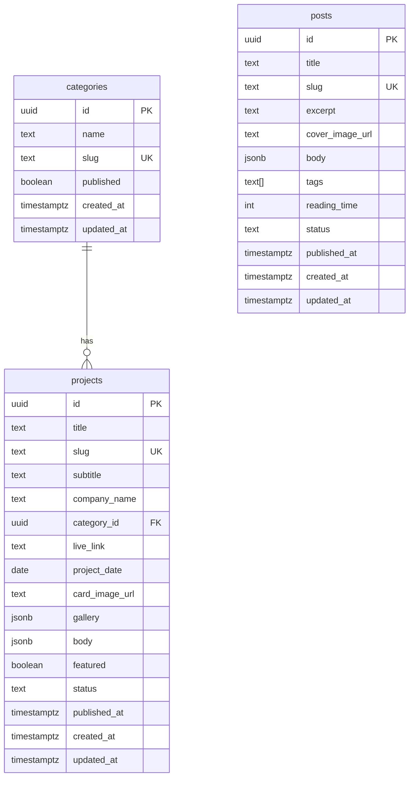

# Portfolio CMS - Technical Architecture

## 1. Stack

- **Framework:** Next.js 15 (App Router) + TypeScript + React 19.
- **Styling:** Tailwind CSS v4 with CSS custom properties (OKLCH tokens from the design brief).
- **Backend:** Supabase - Postgres (data), Auth (single admin, email/password), Storage (images).
- **Editor:** Tiptap (ProseMirror) storing body as JSON; rendered on public pages via a JSON->React renderer.
- **Hosting:** Vercel (recommended) with ISR + on-demand revalidation.

## 2. Data Model



- `status` is a check-constrained text: `'draft' | 'published'`.
- `body` / `gallery` are `jsonb`. `body` holds the Tiptap document.
- `updated_at` maintained by a trigger.

## 3. Security (RLS)

- RLS enabled on all tables.
- **Public (anon) read:** `SELECT` allowed only where `status = 'published'` (categories: `published = true`).
- **Admin write/read-all:** `INSERT/UPDATE/DELETE` and read of drafts require `auth.role() = 'authenticated'`.
- Storage bucket `media`: public read; authenticated write/delete.
- No public sign-up; the single admin user is created manually in Supabase (documented in README).

## 4. App Structure

```
app/
  (public)/
    page.tsx                 # home
    works/page.tsx
    projects/[slug]/page.tsx
    blog/page.tsx
    blog/[slug]/page.tsx
    layout.tsx               # SiteNav + SiteFooter
  admin/
    layout.tsx               # auth gate + AdminShell
    login/page.tsx
    page.tsx                 # dashboard -> redirect to projects
    projects/page.tsx
    projects/[id]/page.tsx
    blog/page.tsx
    blog/[id]/page.tsx
    categories/page.tsx
    categories/[id]/page.tsx
  api/revalidate/route.ts    # on-demand revalidation
lib/
  supabase/{client,server,admin}.ts
  types.ts                   # DB row types
  slug.ts                    # slugify + uniqueness
  tiptap/{extensions,renderer}.tsx
components/
  ui/*                       # primitives
  admin/*                    # CMS components
  public/*                   # site components
supabase/
  migrations/0001_init.sql
  seed.sql
scripts/
  migrate-webflow.ts         # import existing 7 projects
```

## 5. Data Access & Mutations

- **Reads (public):** Server Components query Supabase with the anon client; RLS enforces published-only.
- **Writes (admin):** Next.js Server Actions using a server Supabase client bound to the admin's
  session cookie. Each mutating action calls `revalidatePath()` for affected public routes on publish/unpublish.
- **Slugs:** `slugify(title)`; on collision append `-2`, `-3`. Validated in the action before insert; unique constraint as backstop.

## 6. Route / Action Contracts

| Action | Input | Effect | Revalidates |
|---|---|---|---|
| `createCategory` | name | insert category (draft) | - |
| `updateCategory` | id, fields | update | `/works` if published |
| `deleteCategory` | id | block if projects attached, else delete | - |
| `saveProject` | id?, fields, body | upsert draft | - |
| `publishProject` | id | status=published, published_at | `/works`, `/projects/[slug]`, `/` |
| `unpublishProject` | id | status=draft | same |
| `deleteProject` | id | delete + remove storage assets | `/works`, `/` |
| `savePost`/`publishPost`/`unpublishPost`/`deletePost` | analogous | | `/blog`, `/blog/[slug]` |
| `uploadMedia` | file | store in `media` bucket | returns public URL |

## 7. Edge-Case Handling
- **Slug collision:** auto-suffix + inline validation; DB unique constraint as final guard.
- **Unpublish linked project:** public queries filter by status; `/projects/[slug]` returns `notFound()` for non-published; `/works` omits it.
- **Upload failure / oversized file:** client guards (type in image/*, size <= 8MB), retry, optimistic-with-rollback.
- **Edit published item:** changes persist to row but public reflects only after explicit re-publish (revalidation gated on publish action), avoiding half-published live state.
- **Delete category with projects:** action checks FK usage; blocks with actionable message (reassign first).
- **Broken legacy links:** slugs preserved during migration; unknown slug -> `notFound()` with link back to `/works`.

## 8. Rendering & Performance
- Public pages: `export const revalidate = 3600` + on-demand `revalidatePath` on publish -> near-instant updates without redeploy.
- Images: Next `<Image>` with `sizes`, `aspect-ratio`, `loading="lazy"` (hero `priority`).
- Fonts: `font-display: swap`.
- `content-visibility: auto` on long case-study sections.

## 9. Environment
```
NEXT_PUBLIC_SUPABASE_URL=
NEXT_PUBLIC_SUPABASE_ANON_KEY=
SUPABASE_SERVICE_ROLE_KEY=   # server-only, for migration script + admin tasks
NEXT_PUBLIC_SITE_URL=
```

## 10. Deployment
- Vercel project linked to repo; env vars set in Vercel dashboard.
- Supabase migrations applied via SQL editor or CLI (`supabase db push`).
- Single admin user created in Supabase Auth dashboard.
